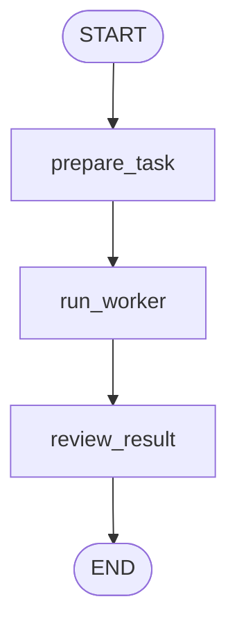
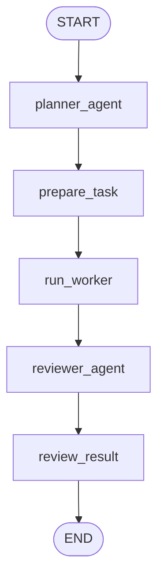
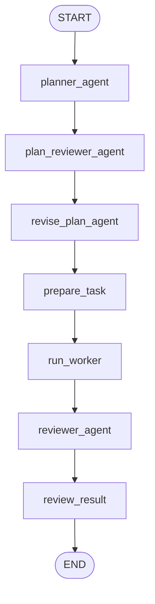
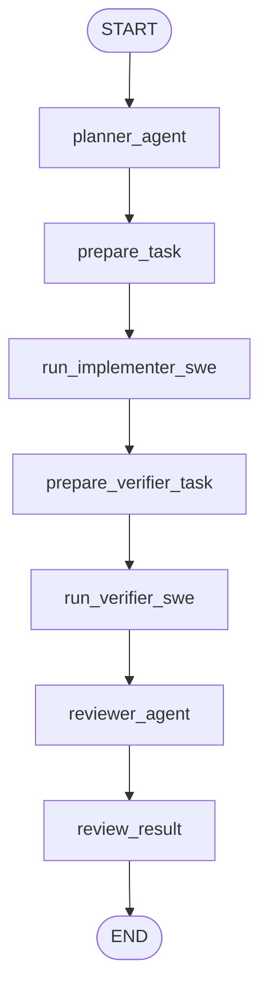

# LangGraph + mini-SWE-agent + LiteLLM PoC

This repository is a lightweight proof-of-concept for exploring orchestration patterns that combine LangGraph with a small "mini-SWE" agent harness and LiteLLM as an LLM gateway. The goals are practical experimentation and fast iteration: run small end-to-end tasks, inspect the LangGraph state and trajectories, and iterate on agent behaviors quickly.

Two Streamlit-based debug UIs are included for rapid interactive testing: `agentchat_streamlit` and `litellmchat_streamlit`.

Highlights:

- Purpose: experiment with orchestration architectures (single-agent, multi-agent, negotiation, coordinator loop).
- Fast feedback: CLI commands save full LangGraph trajectories and state JSON so you can inspect and reproduce runs.
- Reproducibility: example tasks and a shared output directory are included so agent outputs and logs can be preserved.

Quick notes (common confusions):

- Copy `.env.example` to `.env` and update any secrets or endpoint URLs before running Studio or calling remote LLMs.
- Trajectories and other runtime artifacts are saved under `trajectories/` by default — these are treated as ephemeral and are ignored by the repo via `.gitignore`.
- Demo agent code, tests, and logs used for the coordinator loop live under `runs/shared/`.

Quickstart
----------

Follow these minimal steps to run the project locally and exercise the demo flows.

1) Create and activate a virtual environment, install the package, and copy the example env:

```bash
uv sync
cp .env.example .env
```

2) Run a smoke test (no LLM, fast):

```bash
uv run langgraph-mini-swe --mock "Create a hello.py script"
```

3) Start LangGraph Studio locally (optional):

```bash
uv run langgraph dev --no-browser --no-reload
# then open the printed Studio URL in your browser
```

4) Run the coordinator loop (multi-agent demo):

```bash
export OPENAI_API_KEY="..."
uv run langgraph-mini-swe \
  --mode loop \
  --rounds 3 \
  --agents agent_a,agent_b,agent_c \
  --runtime-input 10 \
  --model openai/gpt-4.1 \
  --output trajectories/loop-openai-fib.traj.json \
  --image python:3.11 \
  "Implement Fibonacci with isolated agents"
```

Notes:
- If you rely on a local LiteLLM endpoint, set `LITELLM_API_BASE` in `.env` before running.
- If you want agent outputs on the host filesystem, add `--shared-dir ./runs/shared --shared-mount /workspace/shared` to the run command.

Modes
-----

This project supports several runtime `--mode` options. Use the mode that best matches the behavior you want to explore:

- `single` (default): run the mini-SWE worker alone on the task. Use this for simple end-to-end checks and quick prototyping when you only need one implementer.
- `multi`: add a Planner before the worker and a Reviewer after the worker. Use this to split planning from execution and to observe how a separate reviewer evaluates results.
- `negotiate`: run a Planner → Plan Reviewer → Revise loop before the worker executes. Use this when you want the planner and reviewer to iterate on a plan until it meets criteria (useful for complex tasks where a plan needs refinement).
- `dual-swe`: run two SWE workers in sequence (implementer → verifier) in separate sandboxes. Use this for stronger artifact handoff guarantees where one agent implements and another independently verifies the result.
- `loop`: coordinator loop mode that runs multiple *isolated* agents (for example, `agent_a`, `agent_b`, `agent_c`) in parallel each round and repeats for N rounds. Use `loop` to compare different implementations, collect trajectories for analysis, or run competitions between agent strategies. Add `--shared-dir`/`--shared-mount` to preserve agent outputs on the host.


## Install

```bash
uv sync
cp .env.example .env
```

The default is local Ollama:

```text
MSWEA_MODEL_NAME=qwen3:32b
LITELLM_API_BASE=http://localhost:11436
MSWEA_COST_TRACKING=ignore_errors
MSWEA_TRAJECTORY_PATH=trajectories/last_run.traj.json
```

The worker sends this to LiteLLM as `ollama/qwen3:32b`.

## Smoke Test Without LLM/Docker

```bash
uv run langgraph-mini-swe --mock "Create a hello.py script"
```

Every CLI run saves the full final LangGraph state as JSON. By default, the
state path is derived from `--output`:

```text
trajectories/example.traj.json  ->  trajectories/example.state.json
```

You can override it:

```bash
uv run langgraph-mini-swe \
  --mock \
  --mode negotiate \
  --output trajectories/negotiate-debug.traj.json \
  --state-output runs/negotiate-debug.state.json \
  "Create /tmp/hello.py that prints hello, run it, then submit the result"
```

Inspect useful fields:

```bash
jq '.conversation' trajectories/negotiate-debug.state.json
jq '.worker_task' trajectories/negotiate-debug.state.json
jq '.final' trajectories/negotiate-debug.state.json
```

## Visualize The Graph

```bash
uv run langgraph-mini-swe --graph
uv run langgraph-mini-swe --mode multi --graph
uv run langgraph-mini-swe --mode negotiate --graph
uv run langgraph-mini-swe --mode dual-swe --graph
```

Single-agent graph:



Multi-agent graph:



Negotiation graph:



Dual-SWE graph:



  Loop / Coordinator graph:

  ```mermaid
  flowchart TD
    Start([START]) --> Coordinator[coordinator_loop]
    Coordinator --> Agents{run_agents_in_parallel}
    Agents --> A[agent_a]
    Agents --> B[agent_b]
    Agents --> C[agent_c]
    A --> CollectA[collect_result_a]
    B --> CollectB[collect_result_b]
    C --> CollectC[collect_result_c]
    CollectA --> Merge[merge_round_results]
    CollectB --> Merge
    CollectC --> Merge
    Merge --> Review[review_round]
    Review --> Decide{continue_rounds?}
    Decide -- yes --> Start
    Decide -- no --> End([END])
  ```

## Run LangGraph Studio

This project includes `langgraph.json`, so LangGraph Studio can load:

- `mini_swe_poc`
- `mini_swe_multi`
- `mini_swe_negotiate`
- `mini_swe_dual`
- `mini_swe_loop`

```bash
uv run langgraph dev --no-browser --no-reload
```

Make sure `.env` contains a LangSmith key before starting Studio:

```bash
LANGSMITH_API_KEY=lsv2_...
LANGSMITH_TRACING=false
```

`langgraph.json` is configured with `"env": ".env"`, so restart
`langgraph dev` after changing `.env`.

Open the Studio URL printed by the command:

```text
https://smith.langchain.com/studio/?baseUrl=http://127.0.0.1:2024
```

The local API is available at:

```text
http://127.0.0.1:2024
```

Use this mock input first if you only want to inspect graph state without
calling an LLM or starting Docker:

```json
{
  "task": "Create /tmp/hello.py that prints hello, run it, then submit the result",
  "mode": "negotiate",
  "model": "openai/gpt-4.1",
  "image": "python:3.11",
  "cwd": "/tmp",
  "step_limit": 20,
  "cost_limit": 1.0,
  "cost_tracking": "ignore_errors",
  "timeout": 60,
  "api_base": null,
  "output_path": "trajectories/studio-negotiate.traj.json",
  "shared_dir": "",
  "shared_mount": "/workspace/shared",
  "mock": true
}
```

Useful state fields to inspect:

- `planner_message`
- `plan_review_message`
- `revised_planner_message`
- `conversation`
- `worker_task`
- `worker_result`
- `reviewer_message`
- `final`

If Studio submits an empty/default payload, the graph now fills a default
`task`. You can also use a chat-style input:

```json
{
  "messages": [
    {
      "role": "user",
      "content": "Create /tmp/hello.py that prints hello, run it, then submit the result"
    }
  ],
  "mock": true
}
```

## Run With mini-SWE-agent + Docker

Make sure Docker Desktop is running.

```bash
uv run langgraph-mini-swe \
  --model qwen2.5-coder:32b-instruct-q4_K_M \
  --api-base http://localhost:11436 \
  --output trajectories/qwen-hello.traj.json \
  --image python:3.11 \
  "Create /tmp/hello.py that prints hello, run it, then submit the result"
```

or

```bash
uv run langgraph-mini-swe \
  --model openai/gpt-4.1 \
  --output trajectories/openai-hello.traj.json \
  --image python:3.11 \
  --step-limit 20 \
  "Create /tmp/hello.py that prints hello, run it, then submit the result"
```

or

```bash
uv run langgraph-mini-swe \
  --model anthropic/claude-sonnet-4-5-20250929 \
  --output trajectories/claude-hello.traj.json \
  --image python:3.11 \
  --step-limit 20 \
  "Create /tmp/hello.py that prints hello, run it, then submit the result"
```


The trajectory is saved to the `--output` path. By default this is
`trajectories/last_run.traj.json`.

## Run Multi-Agent Mode

This adds a Planner agent before the SWE worker and a Reviewer agent after it.
They communicate through LangGraph state in the `conversation` field.

```bash
export OPENAI_API_KEY="..."

uv run langgraph-mini-swe \
  --mode multi \
  --model openai/gpt-4.1 \
  --output trajectories/multi-openai-hello.traj.json \
  --image python:3.11 \
  --step-limit 20 \
  "Create /tmp/hello.py that prints hello, run it, then submit the result"
```

## Run Coordinator Loop Mode

This mode keeps multiple isolated agents, runs them in parallel each round, and
lets the coordinator repeat for N rounds. Each agent keeps its own history.

Each agent runs in its own Docker container concurrently (one container per
agent per round).

Default round plan:

- Round 1: implement Fibonacci (recursive, matrix, fast doubling)
- Round 2: add tests for each implementation
- Round 3: run with input and show execution logs

The main CLI task string is appended as a coordinator narrative for every agent.

Note: agent code and test files live inside the Docker sandbox by default.
Use a shared mount if you want outputs on the host.

```bash
export OPENAI_API_KEY="..."

uv run langgraph-mini-swe \
  --mode loop \
  --rounds 3 \
  --agents agent_a,agent_b,agent_c \
  --runtime-input 10 \
  --model openai/gpt-4.1 \
  --output trajectories/loop-openai-fib.traj.json \
  --image python:3.11 \
  "Implement Fibonacci with isolated agents"
```

Example with a shared output directory:

```bash
export OPENAI_API_KEY="..."

uv run langgraph-mini-swe \
  --mode loop \
  --rounds 3 \
  --agents agent_a,agent_b,agent_c \
  --runtime-input 10 \
  --model openai/gpt-4.1 \
  --output trajectories/loop-openai-fib.traj.json \
  --image python:3.11 \
  --shared-dir ./runs/shared \
  --shared-mount /workspace/shared \
  "Implement Fibonacci with isolated agents. Write all outputs to /workspace/shared."
```

## Run Negotiation Mode

This mode lets Planner and Plan Reviewer negotiate before the SWE worker runs:

```text
planner_agent -> plan_reviewer_agent -> revise_plan_agent -> run_worker -> reviewer_agent
```

```bash
export OPENAI_API_KEY="..."

uv run langgraph-mini-swe \
  --mode negotiate \
  --model openai/gpt-4.1 \
  --output trajectories/negotiate-openai-hello.traj.json \
  --image python:3.11 \
  --step-limit 20 \
  "Create /tmp/hello.py that prints hello, run it, then submit the result"
```

## Run Two SWE Agents

This runs two separate mini-SWE-agent workers:

1. `run_implementer_swe` works on the task in one sandbox.
2. `collect_implementer_artifact` parses the implementer's submitted artifact
   content string.
3. `run_verifier_swe` receives that string through LangGraph state, recreates
   the file in a fresh sandbox, and verifies it.

Each SWE worker gets its own trajectory:

- `trajectories/dual-openai-hello.implementer.traj.json`
- `trajectories/dual-openai-hello.verifier.traj.json`

```bash
export OPENAI_API_KEY="..."

uv run langgraph-mini-swe \
  --mode dual-swe \
  --model openai/gpt-4.1 \
  --output trajectories/dual-ip-handoff.traj.json \
  --image python:3.11 \
  --step-limit 20 \
  "Agent A calls curl -4 icanhazip.com, writes a python file named print_ip.py whose content prints that IP. Verifier must run the file, call curl https://api.ipify.org, and pass only if both IP values match."
```

The default dual-SWE handoff does not use a shared filesystem. Agent A submits:

```text
ARTIFACT_PATH=print_ip.py
ARTIFACT_CONTENT_BASE64=...
```

LangGraph decodes that into `artifact_report.artifact_content` and passes it
to Agent B.

## Use Another LiteLLM Endpoint

Point mini-SWE-agent at another LiteLLM-compatible endpoint:

```bash
uv run langgraph-mini-swe \
  --model openai/my-routed-model \
  --api-base http://localhost:4000/v1 \
  "Write and run a small Python factorial script"
```

## Try OpenAI

Set your OpenAI key:

```bash
export OPENAI_API_KEY="..."
```

Then omit `--api-base` and use an OpenAI model:

```bash
uv run langgraph-mini-swe \
  --model openai/gpt-4.1 \
  --output trajectories/openai-hello.traj.json \
  --image python:3.11 \
  --step-limit 20 \
  "Create /tmp/hello.py that prints hello, run it, then submit the result"
```

You can also pass `--model gpt-4.1`; the wrapper normalizes it to
`openai/gpt-4.1`.

## Files

- `src/langgraph_mini_swe_poc/main.py`: CLI entrypoint.
- `src/langgraph_mini_swe_poc/graph.py`: LangGraph orchestration.
- `src/langgraph_mini_swe_poc/worker.py`: mini-SWE-agent worker wrapper.

The important design choice is that LangGraph does not know much about mini-SWE-agent. It just calls `run_swe_worker(...)`, which you can later replace with SWE-ReX, AIO Sandbox, Modal, or multiple parallel workers.
